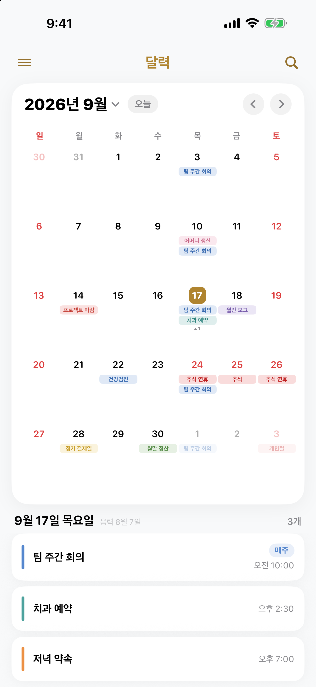
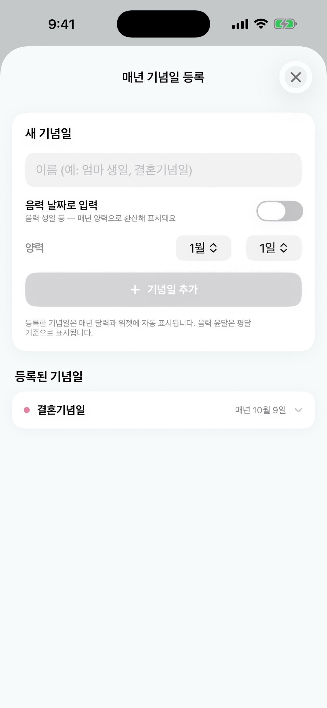
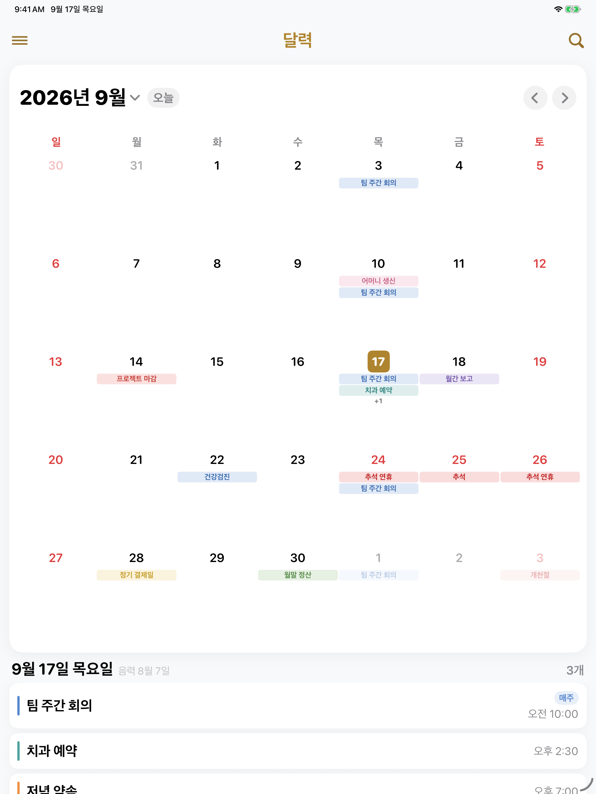

<div align="center">

# 📅 Kalender

**음력과 한국 공휴일을 지원하는 iOS 무료 캘린더 · 위젯 앱**


</div>

---

## 📸 스크린샷

<div align="center">

<table>
  <tr>
    <td align="center"><b>달력 · 일정</b></td>
    <td align="center"><b>매년 기념일</b></td>
  </tr>
  <tr>
    <td></td>
    <td></td>
  </tr>
</table>

<br>

<b>iPad</b><br>


</div>

---

## ✨ 주요 기능

- **달력 / 일정** — 월 달력, 일정 추가·수정, 반복(단일/매주/매달)·종료일·색상
- **한국 공휴일** — 2025~2027 확정 + 이후 연도 자동 계산 (음력 환산 · 대체공휴일)
- **음력** — 선택 날짜의 음력 표시, 매년 기념일(양력/음력) 등록
- **홈 위젯** — Small / Medium / Large 3종, 앱과 별도로 글자 크기 설정
- **알림** — 알림 켠 일정이 있는 날 하루 1회 일괄 알림 (시간 지정)
- **동기화** — iCloud(같은 애플 계정 기기끼리) · 애플 기본 달력 읽기 (각각 on/off)
- **검색 / 연월 이동 / 테마 · 배경색 / 글자 크기 / 다크모드**

---

## 🛠 기술 스택

- **SwiftUI · SwiftData · WidgetKit · EventKit**
- **iOS 17+**
- 프로젝트 생성: [XcodeGen](https://github.com/yonaskolb/XcodeGen) 

---

## 🚀 빌드

```bash
brew install xcodegen        # 최초 1회
xcodegen generate            # PlanWidget.xcodeproj 생성
open PlanWidget.xcodeproj
```

---

## 📂 구조

```
App/Sources/       앱 화면 · 매니저
Widget/Sources/    홈 위젯 (Bundle · Provider · Views)
Shared/Sources/    앱 · 위젯 공용 (모델 · 저장소 · 공휴일 · 음력)
docs/              개인정보 처리방침
project.yml        프로젝트 정의 (XcodeGen 원본)
```
