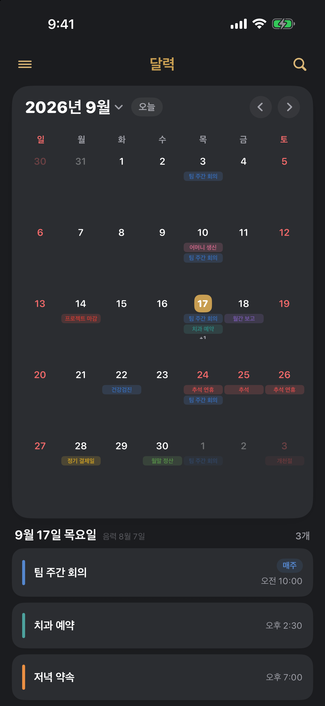

<div align="center">

# 📅 하상원의 달력

**음력과 한국 공휴일을 지원하는 iOS 무료 캘린더 · 위젯 앱**


</div>

---

## 📸 스크린샷

<div align="center">

<table>
  <tr>
    <td align="center"><b>달력 · 일정</b></td>
    <td align="center"><b>다크 모드</b></td>
  </tr>
  <tr>
    <td></td>
    <td></td>
  </tr>
</table>

<br>

<b>iPad</b><br>


</div>

---

## ✨ 주요 기능

- **달력 / 일정** — 월 달력, 일정 추가·수정, 반복(단일/매주/매달)·종료일·색상
- **한국 공휴일** — 2025~2027 확정 + 이후 연도 자동 계산 (음력 환산 · 대체공휴일)
- **음력** — 선택 날짜의 음력 표시, 매년 기념일(양력/음력) 등록
- **홈 위젯** — Small / Medium / Large 3종, 앱과 별도로 글자 크기 설정
- **알림** — 알림 켠 일정이 있는 날 하루 1회 일괄 알림 (시간 지정)
- **동기화** — iCloud(같은 애플 계정 기기끼리) · 애플 기본 달력 읽기 (각각 on/off)
- **검색 / 연월 이동 / 테마 · 배경색 / 글자 크기 / 다크모드**

---

## 🛠 기술 스택

- **SwiftUI · SwiftData · WidgetKit · EventKit**
- **iOS 17+**
- 프로젝트 생성: [XcodeGen](https://github.com/yonaskolb/XcodeGen) 

---

## 🚀 빌드

```bash
brew install xcodegen        # 최초 1회
xcodegen generate            # PlanWidget.xcodeproj 생성
open PlanWidget.xcodeproj
```

---

## 📦 배포

| 구분 | 이름 |
| --- | --- |
| App Store 이름 | 하상원의 달력: 광고없는 위젯 캘린더 음력 생일 공휴일 |
| 기기 표시 이름 (`CFBundleDisplayName`) | 하상원 달력 |

> ⚠️ 두 이름이 충분히 비슷하지 않으면 App Store 심사에서 거절된다 (Guideline 2.3.8 - Accurate Metadata).
> 기기 표시 이름은 `project.yml`의 앱·위젯 양쪽 `CFBundleDisplayName`에 있고,
> 수정 후 `xcodegen generate`를 돌려야 `Info.plist`에 반영된다.

재제출 시 `CURRENT_PROJECT_VERSION`을 올린 뒤, App Store Connect의 버전 페이지에서
새 빌드를 명시적으로 선택해야 한다.

---

## 📂 구조

```
App/Sources/           앱 화면 · 매니저
Widget/Sources/        홈 위젯 (Bundle · Provider · Views)
Shared/Sources/        앱 · 위젯 공용 (모델 · 저장소 · 공휴일 · 음력)
docs/                  개인정보 처리방침
appstore-screenshots/  App Store 제출용 스크린샷
project.yml            프로젝트 정의 (XcodeGen 원본)
```
